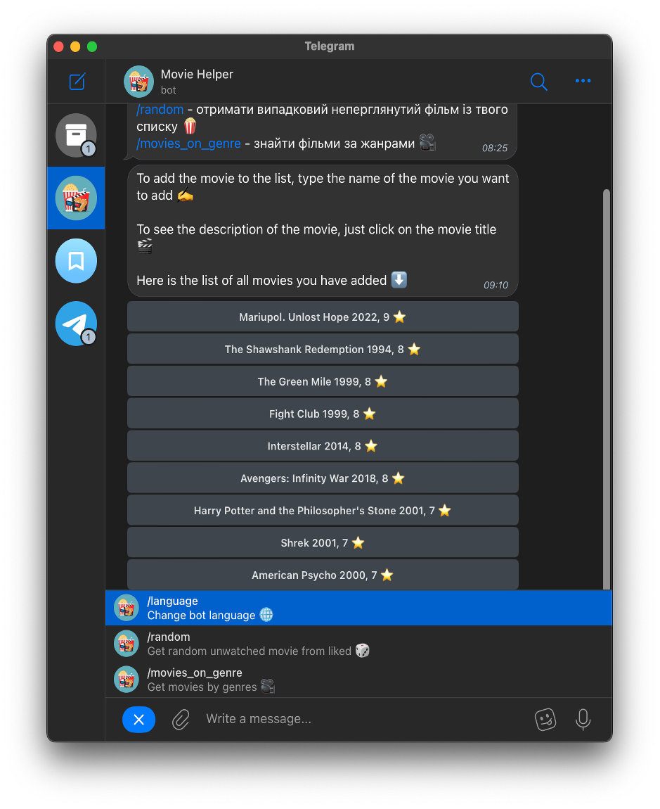
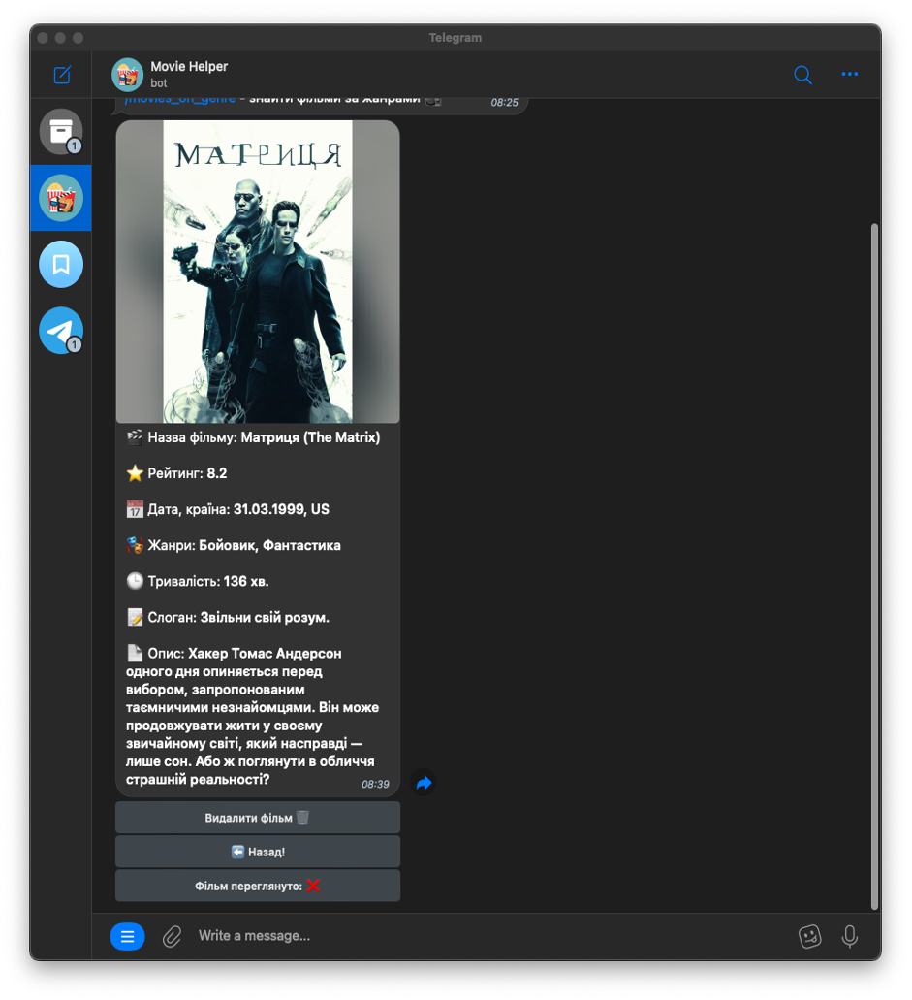
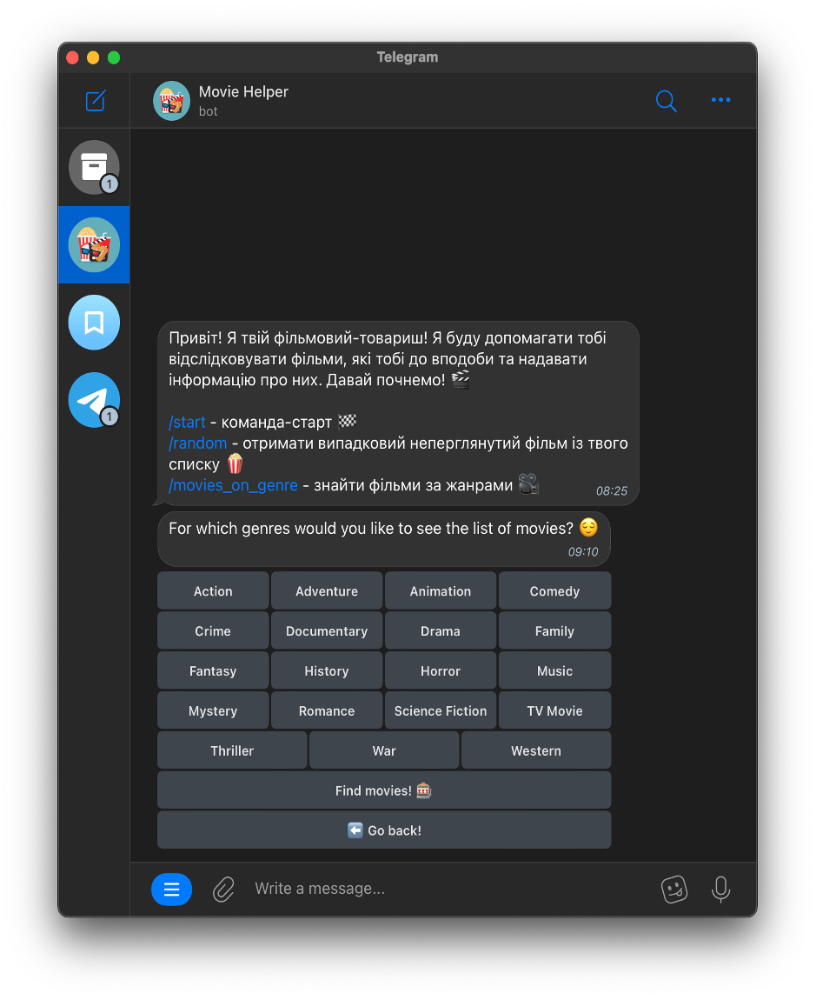

## Cinema Comrade Bot: Your Movie Companion on Telegram

This readme dives into my creation, the Cinema Comrade Bot – a Python-powered Telegram bot that assists you on your movie quest!

**What it Does:**

The Cinema Comrade Bot acts as your friendly neighborhood movie guide on Telegram.  

* **Genre & Movie Exploration:** Dive into a world of cinematic options! The bot presents you with various genres and movies, allowing you to discover your next favorite film. (Implemented in `routers/private/main_menu.py`)

* **Multilingual Support:** Speak your language! The bot caters to users across the globe with its multi-language capabilities. (Powered by the `aiogram_i18n` library with language files stored in `locales/{locale}/LC_MESSAGES`)

* **Database Savvy:** The bot cleverly stores and retrieves information using a database. The `database/engine.py` file manages this interaction, utilizing the powerful `SQLAlchemy` library.

* **Redis Power:** The bot keeps track of your session data with the help of Redis, an in-memory data store. The `utils/redis_manager.py` file ensures a smooth connection and management of this data.

**Technical Stack:**

* **Python:** The core language that brings the bot to life.
* **aiogram:** A high-level framework specifically designed for crafting Telegram bots in Python.
* **aiogram_dialog:** Facilitates smooth user interaction by managing dialogues within the bot.
* **aiogram_i18n:** Breaks down language barriers, enabling multi-language support.
* **SQLAlchemy:** A versatile toolkit for interacting with SQL databases and implementing Object-Relational Mapping (ORM).
* **Redis:** An open-source data store that serves as the bot's session data storage solution. 

**My Journey:**

Developing this bot was a rewarding experience that allowed me to delve deeper into the world of Telegram bot creation with aiogram. I explored user interaction management using aiogram_dialog and implemented multi-language support with aiogram_i18n. Additionally, I harnessed the power of SQLAlchemy for database interaction and utilized Redis for session data storage. 

**Key Takeaways:**

This project solidified my understanding of:

* Creating Telegram bots with aiogram.
* Managing user dialogues using aiogram_dialog.
* Implementing multi-language support with aiogram_i18n.
* Interacting with databases using SQLAlchemy.
* Leveraging Redis for session data storage.

I hope you enjoy exploring the world of cinema with your new companion, the Cinema Comrade Bot!
